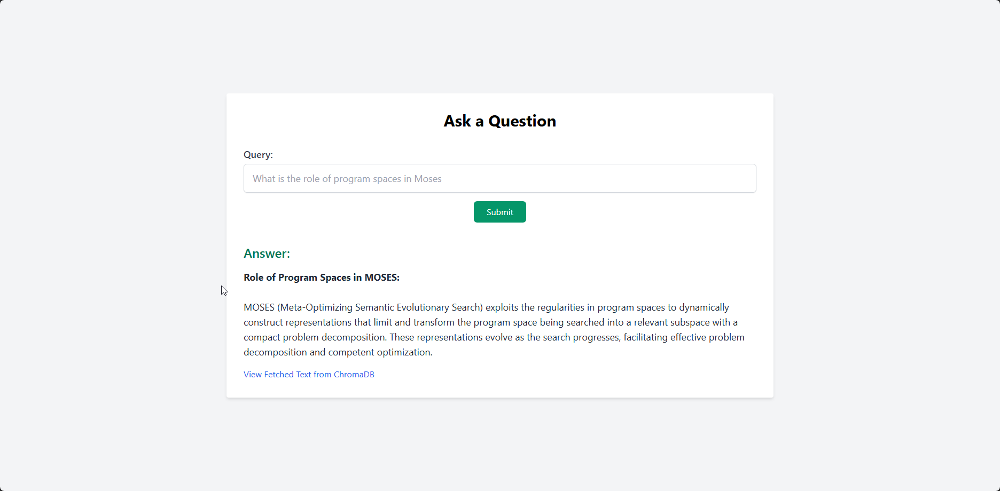

# LangChain

## Overview

This project demonstrates a **LangChain-based Q&A system** that processes the **Competent Program Evolution (CPE)** thesis. By combining LangChain's powerful tools with vector databases and prompt engineering, the application supports document parsing, embedding, retrieval, and dynamic query answering.

The system uses LangChain to streamline the pipeline from PDF parsing to response generation using language models.

---

## LangChain Features

### 1. **Document Loaders**
The **PyPDFLoader** and `partition_pdf` functions from LangChain are used to load and parse the thesis document. These tools allow topic-based splitting of PDF files for better organization and understanding.

- **Key Feature**: The `chunking_strategy="by_title"` ensures that the document is divided by logical sections such as titles and topics.
  
```python
from langchain_community.document_loaders import PyPDFLoader

def parse_pdf(filePath: str):
    raw_pdf_elements = partition_pdf(
        filename=filePath,
        chunking_strategy="by_title",
        max_characters=4000
    )
    return raw_pdf_elements
```

---

### 2. **Text Splitters**
LangChain's **SemanticChunker** is used to break down sections of text into semantically coherent chunks. This is crucial for creating embeddings that represent meaningful segments of the document.

- **Semantic Chunking**: Ensures embeddings capture the essence of each section for accurate retrieval.
  
```python
from langchain_experimental.text_splitter import SemanticChunker

text_splitter = SemanticChunker(embedding_function, breakpoint_threshold_type="percentile")
docs = [text_splitter.split_text(text) for text in raw_text]
```

---

### 3. **Embeddings**
The system leverages **HuggingFaceEmbeddings** to convert chunks of text into high-dimensional vectors. These embeddings represent the semantic meaning of each chunk, allowing efficient storage and retrieval.

```python
from langchain_community.embeddings import HuggingFaceEmbeddings

embedding_function = HuggingFaceEmbeddings(model_name="sentence-transformers/all-MiniLM-L6-v2", model_kwargs={'device': 'cpu'})
```

---

### 4. **Vector Store**
LangChain's integration with **Chroma** as the vector store enables the system to store embeddings and perform similarity searches. This is key to retrieving relevant document sections based on user queries.

```python
from langchain_community.vectorstores import Chroma

vectorstore = Chroma.from_texts(texts, embedding_function, persist_directory="./comprog_chroma_db")
```

---

### 5. **Prompt Engineering**
LangChain’s **PromptTemplate** structures the interaction between the retrieved context and the user query. This ensures accurate and context-aware responses from the language model.

```python
from langchain.prompts import PromptTemplate

prompt_template = PromptTemplate(
    input_variables=["query", "context"],
    template="Use the following context to answer the query: {context}\nQuery: {query}"
)
```
## Setup Instructions

To set up this project on your local machine, follow these steps:

### 1. **Clone the Repository**

First, clone the repository to your local machine:

```bash
git clone https://github.com/BrookFeleke/Semrag.git
cd Semrag
```

### 2. **Install Dependencies**

You can install these packages using the following command:

```bash
pip install -r requirements.txt
```

### 3. **Configure Environment Variables**

The project requires an API key for Gemini AI, which needs to be stored in an `.env` file. Create a file named `.env` in the root directory of the project with the following content:

```dotenv
GEMINI_API_KEY=your_gemini_api_key_here
```

Replace `your_gemini_api_key_here` with your actual Gemini API key. This key is necessary for the project to interact with the Gemini AI API.

### 4. **Run the Application**

With everything set up, you can now run the Flask application using the following command:

```bash
python rag.py
```

The application will start, and you can access it by navigating to `http://127.0.0.1:5000/` in your web browser.

### Screenshots


---


